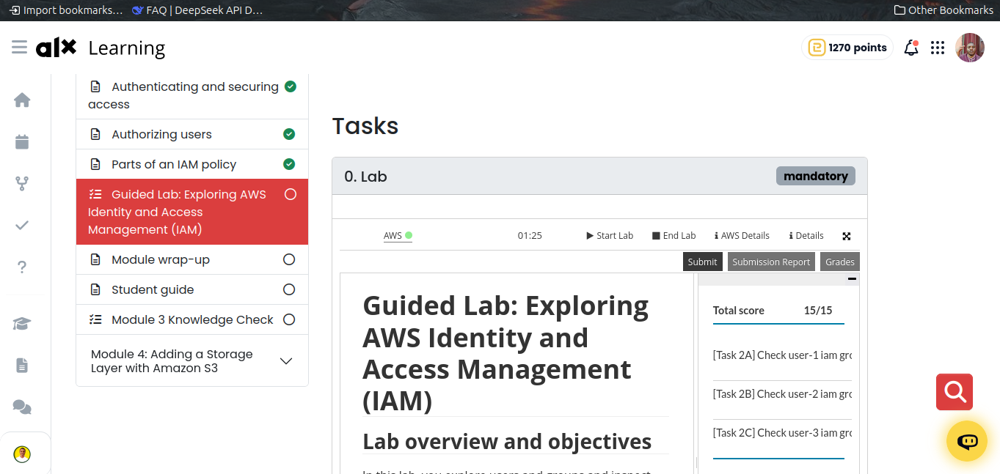

# ALX Cloud Program - Week 2 Lab 1: AWS Identity and Access Management (IAM)

## Lab Overview

This lab focused on exploring AWS Identity and Access Management (IAM), a critical service for controlling access to AWS resources. Through hands-on activities, I learned how to manage users, groups, and policies within AWS IAM to implement secure access controls.

## Learning Objectives Achieved

 **Explored pre-created IAM users and groups**  
**Inspected IAM policies applied to groups**  
**Followed a real-world scenario for adding users to groups with specific capabilities**  
**Located and used the IAM sign-in URL**  
**Tested the effects of policies on service access**

## Key Concepts Learned

### IAM Users and Groups
- **Users**: Individual accounts representing people or services that interact with AWS
- **Groups**: Collections of users that simplify permission management
- **Policies**: Documents that define permissions (allowances/denials) for specific AWS resources

### Types of Policies
1. **Managed Policies**: Pre-built policies (by AWS or administrators) that can be attached to multiple users/groups
2. **Inline Policies**: Custom policies attached to a single user or group for specific situations

### Policy Structure
IAM policies follow this basic structure:
- **Effect**: Allow or Deny permissions
- **Action**: Specific API calls that can be made against AWS services
- **Resource**: Scope of entities covered by the policy rule

## Lab Scenario Summary

In this lab, I worked with three users and three groups to implement a business scenario:

| User | Group | Permissions |
|------|-------|-------------|
| user-1 | S3-Support | Read-only access to Amazon S3 |
| user-2 | EC2-Support | Read-only access to Amazon EC2 |
| user-3 | EC2-Admin | View, Start, and Stop Amazon EC2 instances |

## Practical Tasks Completed

1. **Task 1**: Explored existing IAM users and groups, inspected their policies
2. **Task 2**: Added users to appropriate groups based on their roles
3. **Task 3**: Tested permissions by signing in as different users and verifying access levels

## Lab Completion Evidence

## Key Takeaways

- Proper IAM setup is crucial for maintaining security in AWS environments
- Using groups with policies is more efficient than assigning permissions individually to users
- Read-only access is ideal for support roles that need to monitor resources without making changes
- Administrative roles require more specific permissions tailored to their responsibilities
- Testing permissions after setup ensures policies are correctly applied

## Duration
- Approximately 40 minutes to complete the lab

## Skills Demonstrated
- Understanding of IAM hierarchy (users → groups → policies)
- Ability to assign users to appropriate groups based on job function
- Verification of policy effectiveness through practical testing
- Knowledge of AWS service-specific permissions (EC2, S3)

---
*Completed as part of the ALX Cloud Program - Week 2 Lab 1*  
*Date: January 29, 2026*