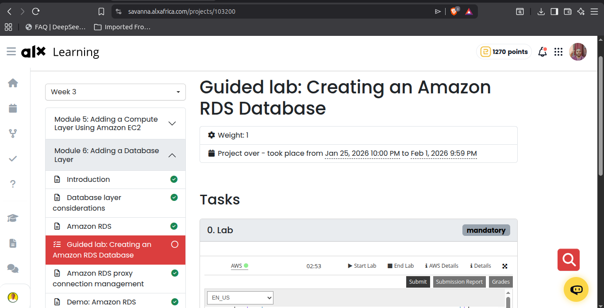
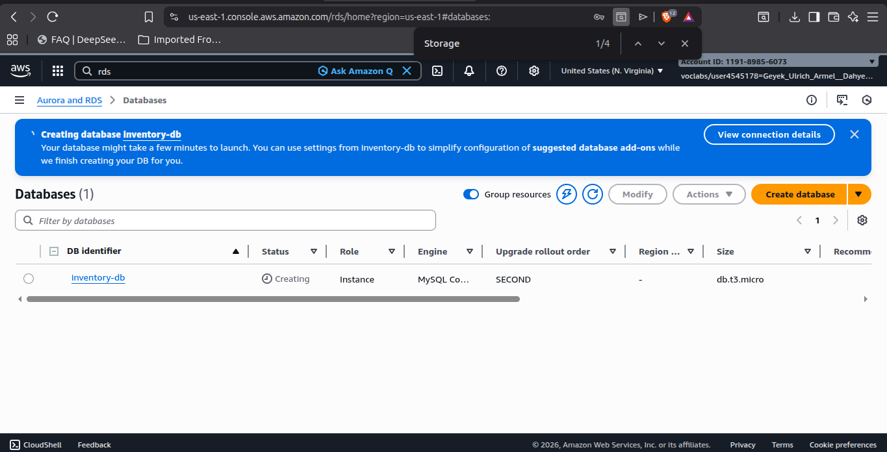
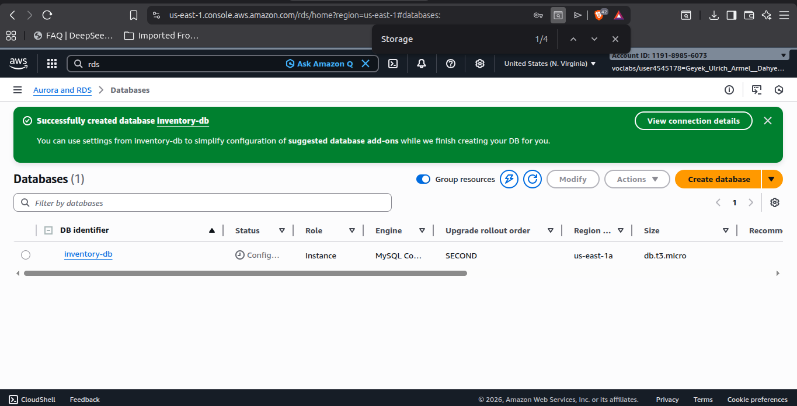
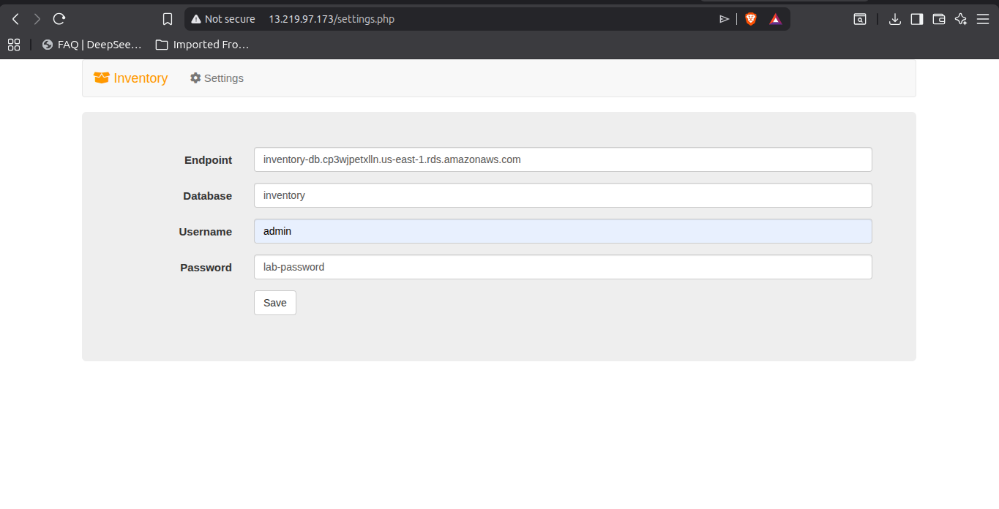
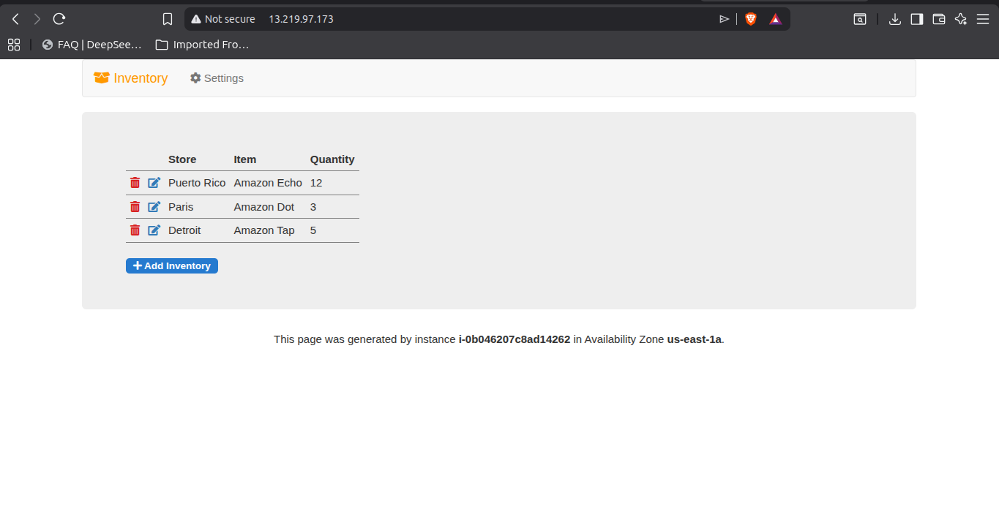
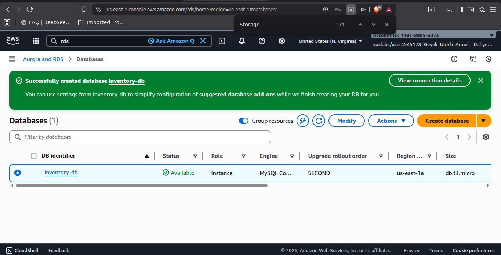
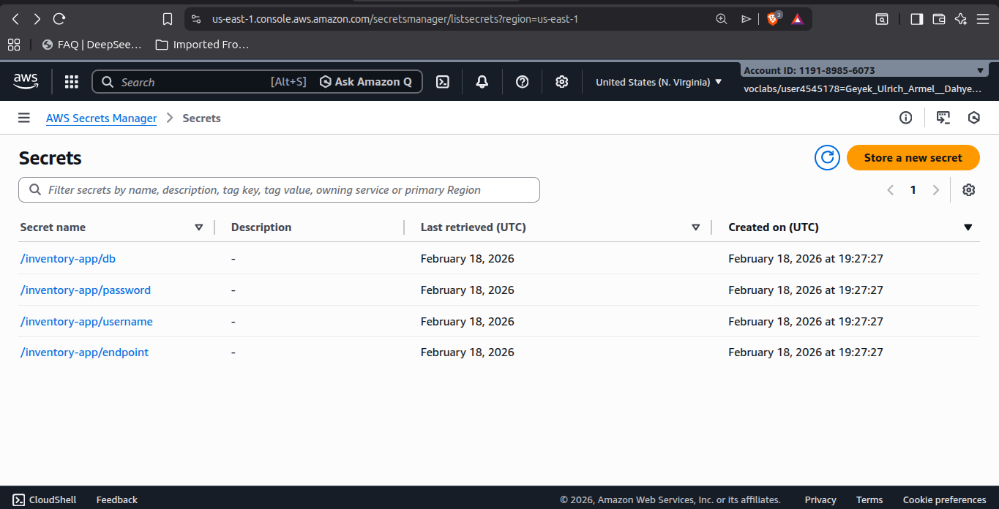
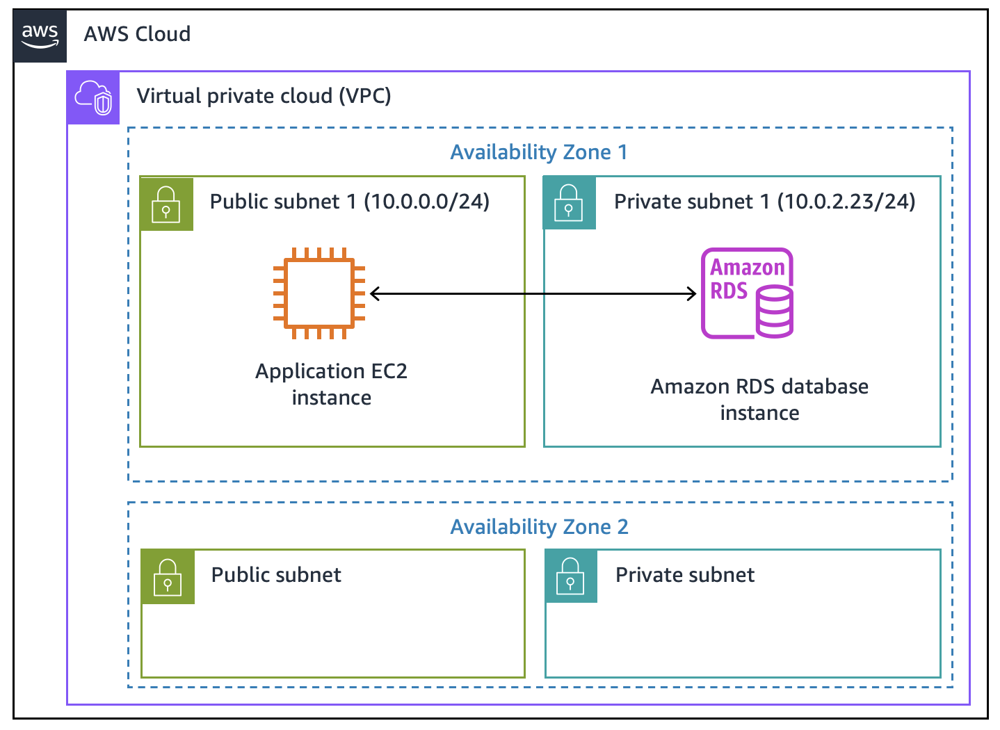

# Creating an Amazon RDS Database - Lab Documentation

**ALX AWS Cloud Computing | Week 3**

---

## What This Lab Is About

This lab walks through setting up a managed MySQL database using Amazon RDS and connecting it to a web application running on EC2. The main goal is to understand how cloud-managed databases work and how applications connect to them securely.

---

## My Setup

| Component | Configuration |
|-----------|---------------|
| Database Engine | MySQL |
| Instance Type | db.t3.micro (Free Tier) |
| Storage | 20 GB gp2 SSD |
| Database Name | inventory |
| VPC | Lab VPC |
| Security Group | DB-SG |

---

## Step-by-Step Process

### 1. Starting the Lab Environment

First, I clicked "Start Lab" and waited for the environment to provision. The green indicator next to the AWS link shows when everything is ready.



### 2. Creating the RDS Instance

Navigated to RDS console and started the database creation wizard. The number of options was overwhelming at first - engine type, instance class, storage, networking, backups. I had to carefully follow the lab instructions to avoid getting lost.

Key settings I configured:
- Selected MySQL as the engine
- Chose Free Tier template (this automatically sets it to Single-AZ)
- Set the DB identifier as `inventory-db`
- Master username: `admin`
- Password: `lab-password`
- Instance class: `db.t3.micro` under Burstable classes
- Storage: 20 GB gp2, disabled autoscaling
- VPC: Lab VPC with DB-SG security group
- Initial database name: `inventory`



The creation took longer than expected - probably 5-7 minutes. The status stayed at "Creating" for what felt like forever, but I learned that RDS instances take time because AWS is provisioning actual infrastructure, setting up the database engine, and running health checks.



### 3. Connecting the Web Application

The lab already had an EC2 instance running with a web application. I got the public IP from the lab details panel and opened it in a new tab.

The application looked bare - just a basic interface with no data. Clicked on Settings to configure the database connection.



To get the database endpoint, I went back to the RDS console, selected my `inventory-db` instance, and copied the endpoint from the Connectivity tab. 

Filled in the connection form:
- Endpoint: (copied from RDS)
- Database: inventory
- Username: admin
- Password: lab-password

When I clicked Save, the application connected successfully.



### 4. Understanding What Happened Behind the Scenes

This part clicked for me - when I saved the credentials, the application stored them in AWS Secrets Manager instead of keeping them in a config file. This is actually how production applications should work. No hardcoded passwords in source code.

The app then:
1. Retrieved credentials from Secrets Manager
2. Connected to the RDS instance
3. Loaded initial data
4. Displayed the inventory interface

### 5. Adding Data Through the Web Interface

Started adding inventory items to test the connection. Each add, edit, and delete operation was actually hitting the RDS database in the background.


I made sure to add at least 5 records as required. The data persists in RDS, so even if the EC2 instance goes down, the inventory data stays safe.



### 6. Checking Secrets Manager

Went to the Secrets Manager console to see what was stored there. Found the database credentials stored as a secret with all the connection details.



This made the security concept click - the application never stores passwords in plain text. It just calls Secrets Manager at runtime to get them.

---

## Final Architecture



The setup shows a classic two-tier architecture:
- Web tier (EC2) handles the application logic and user interface
- Data tier (RDS) handles data storage and retrieval
- Security layer (Secrets Manager) manages credentials

---

## What I Learned

**RDS simplifies database management** - No need to SSH into a server and install MySQL manually. AWS handles the provisioning, patching, and backups.

**Security groups act as firewalls** - The DB-SG security group controls which resources can connect to the database. Without proper security group rules, the EC2 instance could not reach RDS.

**Secrets Manager is better than config files** - Storing credentials in Secrets Manager means I can rotate passwords without redeploying the application. Also means no passwords in version control.

**Database endpoints abstract the infrastructure** - The endpoint URL stays the same even if AWS changes the underlying IP address. The application just needs to know the endpoint.

**Single-AZ vs Multi-AZ matters** - This lab used Single-AZ which is fine for learning. Production databases usually run Multi-AZ for high availability.

---

## Challenges I Faced

1. **Waiting for RDS to become available** - The database creation took longer than the estimated 20 minutes for the whole lab. Had to be patient.

2. **Finding the database endpoint** - Initially looked in the wrong tab. The endpoint is under Connectivity & Security, not Configuration.

3. **Security group confusion** - At first I did not understand why we removed the default security group. Later realized DB-SG already had the correct inbound rules for the application.

4. **Browser tab management** - Needed the RDS console, the web app, and the lab instructions all open at once. Got messy.

---

## Commands and Values Reference

```
DB Instance Identifier: inventory-db
Master Username: admin
Master Password: lab-password
Database Name: inventory
Instance Class: db.t3.micro
Storage Type: gp2
Storage Size: 20 GB
VPC: Lab VPC
Security Group: DB-SG
```

---

## Submission

After adding 5 inventory records, I clicked Submit at the top of the lab instructions. The grading took a minute to process.

---

**Lab completed in approximately 25 minutes**

*Documentation written as part of ALX AWS Cloud Computing - Week 3*
