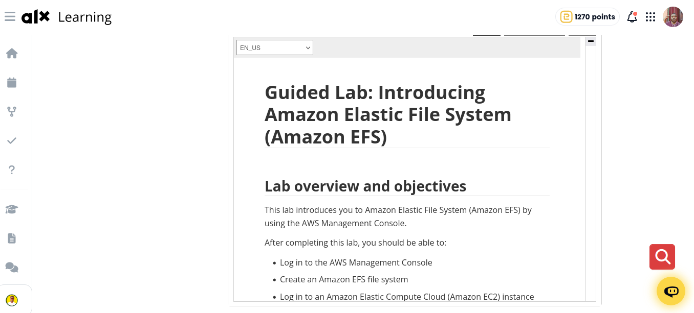
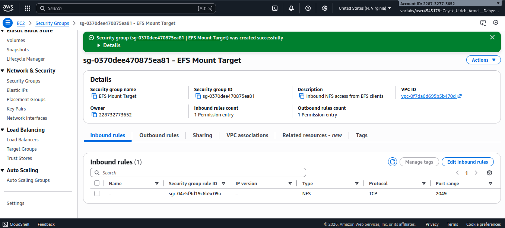
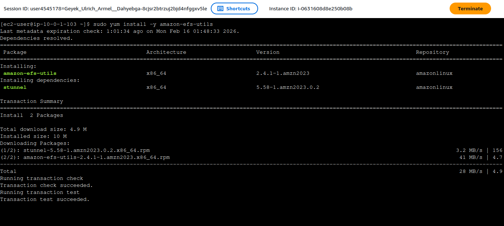
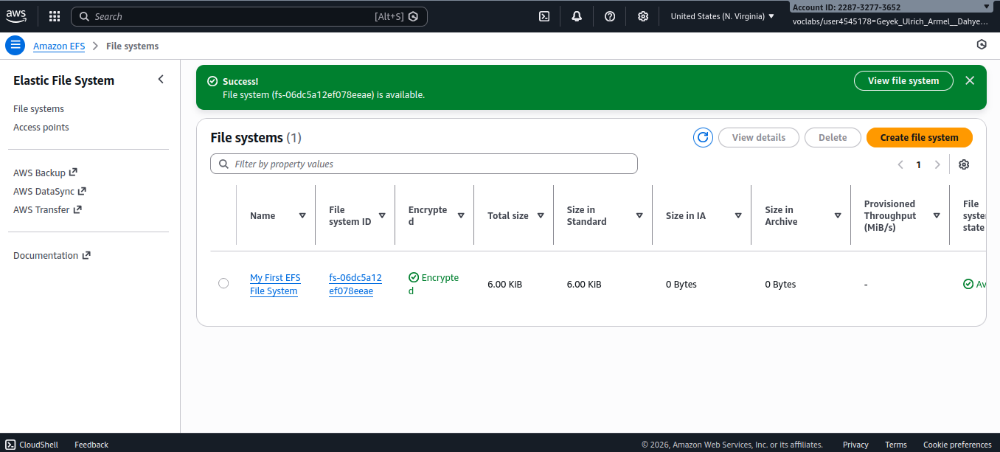
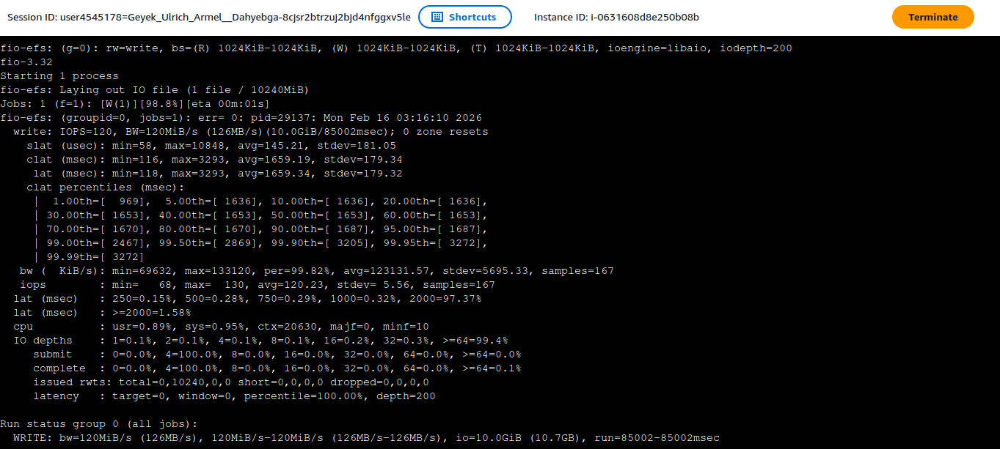

# Amazon Elastic File System (EFS) Guided Lab, ALX Africa

## Table of Contents
- [Introduction](#introduction)
- [Lab Overview](#lab-overview)
- [Objectives](#objectives)
- [What I Learned](#what-i-learned)
- [Challenges Faced](#challenges-faced)
- [Lab Steps and Process](#lab-steps-and-process)
- [Images and Screenshots](#images-and-screenshots)
- [Performance Analysis](#performance-analysis)
- [Conclusion](#conclusion)

## Introduction

This document provides a comprehensive report on the completion of the "Introducing Amazon Elastic File System (EFS)" lab. Amazon EFS is a fully managed, elastic, and scalable file storage service designed for use with AWS Cloud services and on-premises resources. This lab provided hands-on experience with creating, configuring, and managing an EFS file system, connecting it to an EC2 instance, and monitoring its performance.

## Lab Overview

Duration: Approximately 60 minutes which can extended  
Environment: AWS Management Console with pre-configured lab resources  
Platform: Amazon Linux EC2 instance with EFS integration

## Objectives

By completing this lab, I achieved the following objectives:

-  Log in to the AWS Management Console
-  Create an Amazon EFS file system
-  Connect to an Amazon EC2 instance running Amazon Linux
-  Mount the EFS file system to the EC2 instance
-  Examine and monitor the performance of the file system

## What I Learned

### Key Concepts
1. **EFS Fundamentals**: Understanding that EFS provides scalable, elastic file storage that can be accessed by multiple EC2 instances simultaneously
2. **Network File System (NFS)**: Learning that EFS uses NFSv4.1 protocol for mounting file systems to EC2 instances
3. **Security Groups**: Configuring security groups to allow NFS traffic on port 2049
4. **Mount Targets**: Understanding how mount targets enable access to EFS from EC2 instances in specific Availability Zones
5. **Performance Scaling**: Learning how EFS performance scales with the amount of data stored

### Technical Skills Acquired
- Creating and configuring EFS file systems through the AWS Management Console
- Setting up security groups specifically for EFS access
- Installing EFS utilities on Amazon Linux instances
- Mounting EFS file systems using NFS commands
- Using fio (Flexible I/O) tool for performance benchmarking
- Monitoring EFS performance through Amazon CloudWatch

### Performance Insights
- EFS provides baseline performance of 50 MiB/s per TiB of storage
- File systems can burst to 100 MiB/s regardless of size
- Larger file systems (>1TB) can burst to 100 MiB/s per TiB
- Throughput is shared across all connected EC2 instances

## Challenges Faced

### 1. Security Group Configuration
Initially, I had to carefully configure the security group to allow NFS traffic on port 2049. Understanding the correct source configuration (using the security group ID of the client) was crucial for establishing connectivity.

### 2. Mount Command Syntax
Understanding the mount command syntax with all the NFS-specific options (nfsvers=4.1, rsize, wsize, hard, timeo, retrans, noresvport) required careful attention to ensure optimal performance.

### 3. Timing Dependencies
There were timing considerations during the lab:
- Waiting for the EFS file system state to change to "Available"
- Waiting for mount targets to become available (2-3 minutes)
- Ensuring CloudWatch metrics populated before viewing performance graphs

### 4. Performance Monitoring
Interpreting the CloudWatch metrics required understanding the relationship between different metrics like PermittedThroughput and DataWriteIOBytes, and how they relate to actual performance during the fio benchmark test.

## Lab Steps and Process

### Task 1: Security Group Creation
1. Created a security group named "EFS Mount Target" in the Lab VPC
2. Added an inbound rule for NFS (TCP port 2049) with the EFSClient security group as the source
3. This configuration allows NFS traffic between EC2 instances and EFS mount targets

### Task 2: EFS File System Creation
1. Created a new EFS file system with the name "My First EFS File System"
2. Disabled automatic backups for this lab environment
3. Configured mount targets in all available Availability Zones within the Lab VPC
4. Applied the custom security group to all mount targets

### Task 3: EC2 Instance Connection
1. Used AWS Systems Manager Session Manager to connect to the EC2 instance
2. This provided secure access without requiring SSH keys or public IP addresses

### Task 4: Directory Creation and Mounting
1. Installed the required EFS utilities using `sudo yum install -y amazon-efs-utils`
2. Created a directory named "efs" for mounting the file system
3. Used the mount command provided in the EFS console to connect the file system
4. Verified the mount was successful using `df -hT`

### Task 5: Performance Examination
1. Used the fio tool to conduct write performance testing
2. Monitored performance metrics in Amazon CloudWatch
3. Analyzed PermittedThroughput and DataWriteIOBytes metrics

## Images and Screenshots

The following screenshots document the key stages of the lab:

### Starting the Lab

*Initial setup and lab detail alx savana page*

### Security Group Creation

*Configuration of the EFS Mount Target security group with NFS access rules*

### Installing EFS Dependencies

*Terminal output showing the installation of amazon-efs-utils package*

### EFS File System Created

*Confirmation of successful EFS file system creation with mount targets*

### Performance Examination

*Results from the fio performance benchmark test showing write performance characteristics*

### Command Execution

*Terminal command showing the installation of EFS utilities on the EC2 instance*

## Performance Analysis

### Benchmark Results
The fio benchmark test revealed the following performance characteristics:
- File size: 10GB test file
- Block size: 1MB
- I/O depth: 200
- Write operation with direct I/O

### CloudWatch Metrics
Two key metrics were analyzed:
1. **PermittedThroughput**: Shows the throughput capacity allocated to the file system
2. **DataWriteIOBytes**: Measures actual write I/O operations

The peak throughput values observed were approximately:
- Permitted Throughput: ~3GB/s
- Write Throughput: ~7.6GB total over the test duration

### Performance Scaling Behavior
The lab demonstrated EFS's elastic nature:
- Performance scales linearly with the amount of data stored
- Burst capabilities allow for high throughput during intensive operations
- Throughput is shared among all connected instances

## Conclusion

This lab provided valuable hands-on experience with Amazon EFS, demonstrating its core capabilities and benefits. Key takeaways include:

1. **Scalability**: EFS automatically scales to accommodate growing storage needs without manual intervention
2. **Accessibility**: Multiple EC2 instances across different Availability Zones can access the same file system simultaneously
3. **Performance**: The service delivers consistent performance that scales with storage size
4. **Management**: Fully managed service reduces operational overhead compared to self-managed file systems

The lab successfully demonstrated how EFS can serve as a shared file system for distributed applications, with the added benefits of AWS's reliability and scalability. Understanding the security group configurations and mount target concepts is crucial for implementing EFS in production environments.

This foundational knowledge of EFS will be valuable for designing scalable, distributed applications that require shared file storage accessible across multiple compute instances.

By: Geyek Ulrich Armel, ALX Africa Cloud student.
