# Week 3 Lab 2: Creating a Dynamic Website for the Cafe

## Overview

This lab demonstrates how to deploy a dynamic web application on Amazon EC2 that enables online ordering for a cafe business. The solution includes creating a development environment, capturing it as an AMI, and deploying a production environment in a different AWS Region for disaster recovery.

## Learning Objectives

By completing this lab, I learned to:

- Connect to a VS Code IDE running on an EC2 instance
- Configure a LAMP (Linux, Apache, MySQL, PHP) stack environment
- Install and configure a web application using AWS Secrets Manager
- Test a dynamic web application with database integration
- Create an Amazon Machine Image (AMI) from a configured EC2 instance
- Deploy applications across multiple AWS Regions

## Architecture

### Starting Architecture

The lab begins with the following pre-configured resources:
- One EC2 instance (Lab IDE) running in us-east-1 region
- VPC with public subnets
- Security groups with restricted access

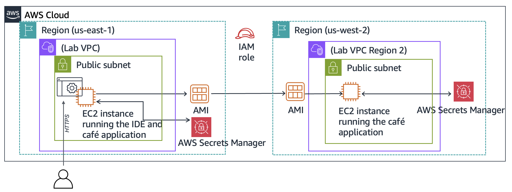

### Final Architecture

After completion, the architecture includes:
- Development environment in us-east-1 (N. Virginia)
- Production environment in us-west-2 (Oregon)
- Secrets Manager storing application credentials in both regions
- EC2 instances running Apache, MySQL, and PHP applications


## Lab Duration

Approximately 60 minutes, i had to extend to complete the lab and learn, 

---

## Task 1: Analyzing the Existing EC2 Instance

### Steps

1. Opened the Amazon EC2 console
2. Navigated to Instances
3. Identified the running instance named "Lab IDE"

### Key Observations

- Instance type and configuration
- Subnet type (public/private)
- Public IP address assignment
- Security group inbound rules
- IAM role association

---

## Task 2: Connecting to the IDE on the EC2 Instance

### Steps

1. Retrieved LabIDEURL and LabIDEPassword from AWS Details panel
2. Opened the VS Code IDE in a browser tab
3. Entered the password to access the development environment

### IDE Components

- Bash terminal (bottom-right panel)
- File browser (left panel) showing /home/ec2-user/environment
- File editor (upper-right panel)

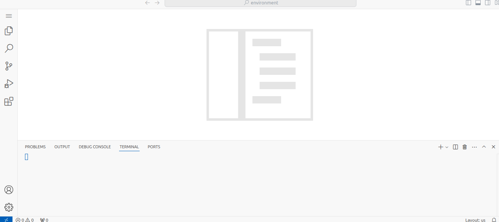

---

## Task 3: Configuring the LAMP Stack Environment

### Operating System Verification

```bash
cat /proc/version
```

Output confirmed Amazon Linux (similar to Red Hat 7)

### Web Server Configuration

```bash
# Change Apache to listen on port 8000 (port 80 used by IDE)
sudo sed -i 's/Listen 80/Listen 8000/g' /etc/httpd/conf/httpd.conf

# Start and enable Apache service
sudo systemctl start httpd
sudo systemctl enable httpd
sudo service httpd status

# Check PHP version
php --version
```

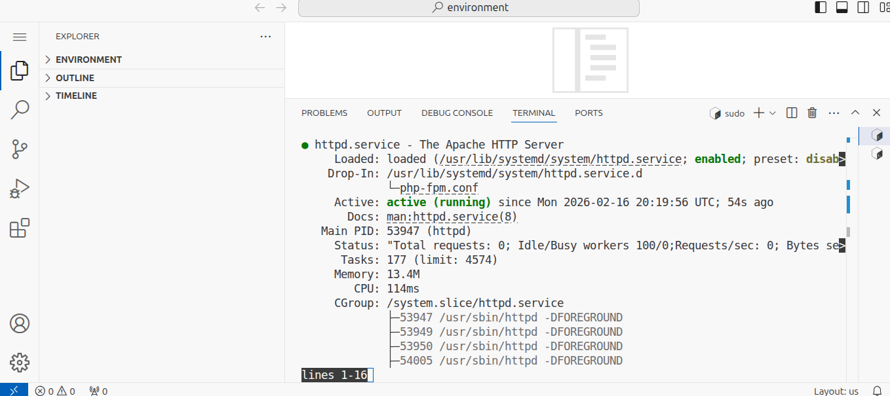

### Database Installation

```bash
# Install MariaDB
sudo dnf install -y mariadb105-server

# Start and enable MariaDB service
sudo systemctl start mariadb
sudo systemctl enable mariadb
sudo mariadb --version
sudo service mariadb status
```

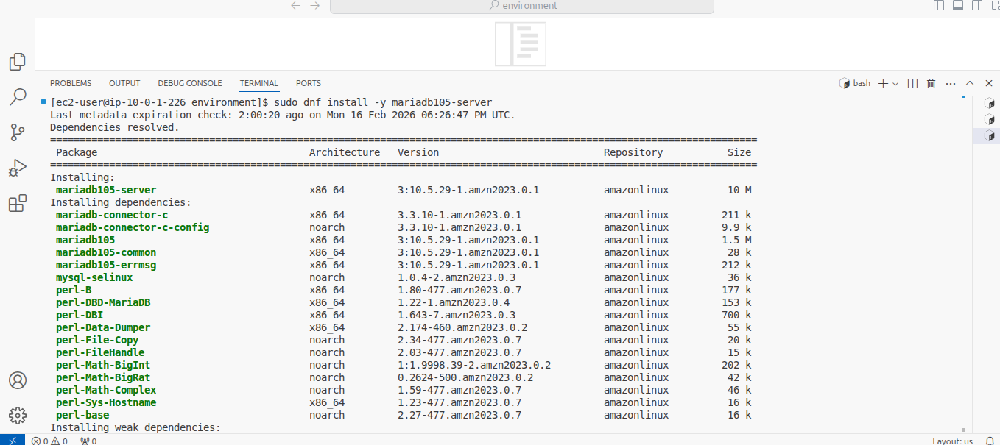
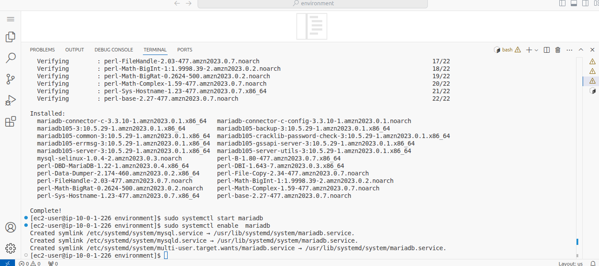
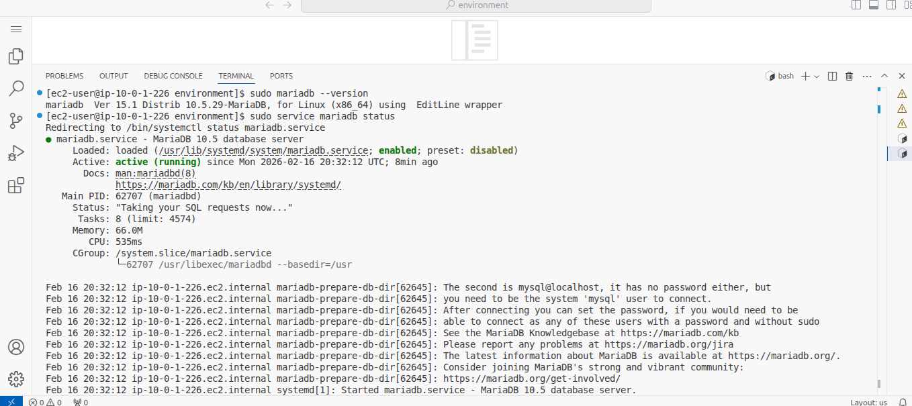

### File Access Configuration

```bash
# Create symlink to web directory
ln -s /var/www/ /home/ec2-user/environment

# Change ownership for editing
sudo chown ec2-user:ec2-user /var/www/html
```

### Test Page Creation

Created index.html in /var/www/html with content:
```html
<html>Hello from the cafe web server!</html>
```

### Security Group Configuration

Updated inbound rules to allow traffic on port 8000 from the internet.

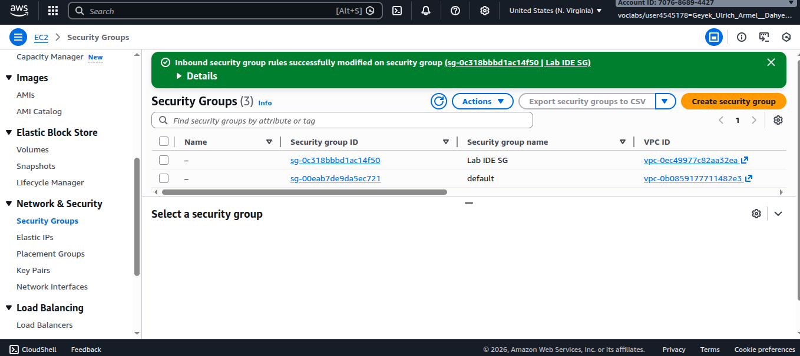

### Verification

Accessed http://<public-ip>:8000/ to confirm the test page loads.

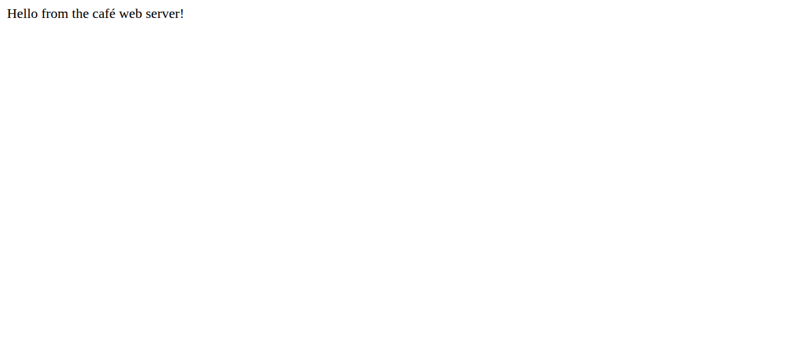

---

## Task 4: Installing the Cafe Application

### Downloading Application Files

```bash
cd ~/environment

# Download and extract application files
wget https://aws-tc-largeobjects.s3.us-west-2.amazonaws.com/CUR-TF-200-ACACAD-3-113230/03-lab-mod5-challenge-EC2/s3/setup.zip
unzip setup.zip

wget https://aws-tc-largeobjects.s3.us-west-2.amazonaws.com/CUR-TF-200-ACACAD-3-113230/03-lab-mod5-challenge-EC2/s3/db.zip
unzip db.zip

wget https://aws-tc-largeobjects.s3.us-west-2.amazonaws.com/CUR-TF-200-ACACAD-3-113230/03-lab-mod5-challenge-EC2/s3/cafe.zip
unzip cafe.zip -d /var/www/html/

cd /var/www/html/cafe/

# Download AWS SDK
wget https://docs.aws.amazon.com/aws-sdk-php/v3/download/aws.zip
wget https://docs.aws.amazon.com/aws-sdk-php/v3/download/aws.phar
unzip aws -d /var/www/html/cafe/

# Set permissions
chmod -R +r /var/www/html/cafe/
```

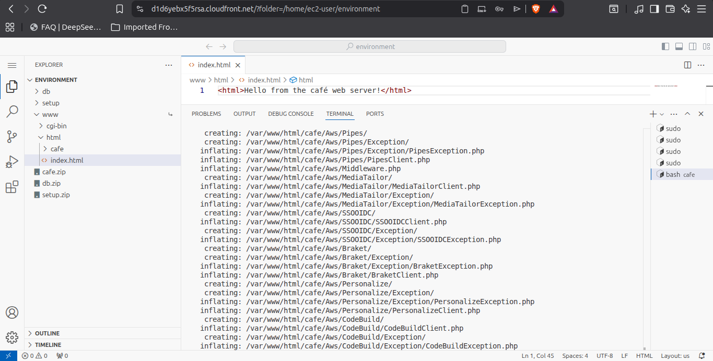

### Application Structure

The application consists of:
- **cafe/** - Main web application files
- **db/** - Database setup scripts
- **setup/** - Configuration scripts for Secrets Manager

### Configuring AWS Secrets Manager

```bash
cd ~/environment/setup/
./set-app-parameters.sh
```

This script creates seven secrets in AWS Secrets Manager that the application uses for database connections and other configurations.

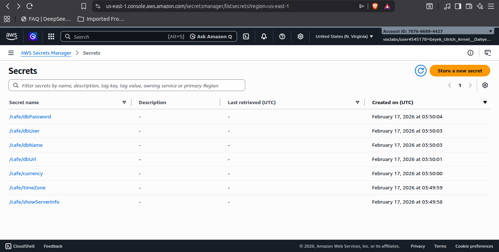

### Database Configuration

```bash
# Set root password and create database
cd ../db/
./set-root-password.sh
./create-db.sh

# Connect to MySQL to verify
mysql -u admin -p
```

When prompted, entered the dbPassword value retrieved from Secrets Manager.


### Database Verification

```sql
show databases;
use cafe_db;
show tables;
select * from product;
exit;
```


### PHP Time Zone Configuration

```bash
sudo sed -i "2i date.timezone = \"America/New_York\" " /etc/php.ini
sudo service httpd restart
```

### Troubleshooting the Web Application

The cafe website initially failed to load properly. The issue was related to IAM permissions.

**Solution:** Configured the IAM role (CafeRole) with appropriate permissions to access Secrets Manager.

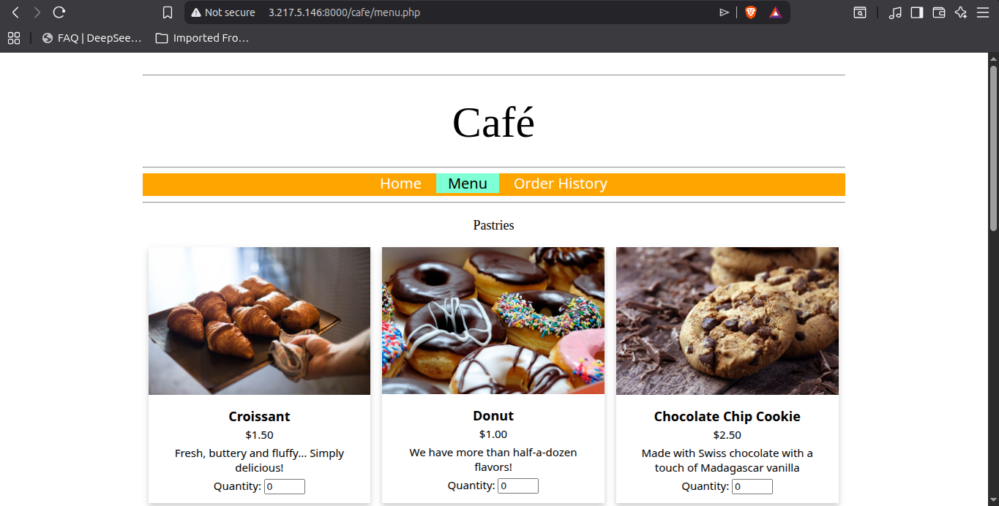

### Final Verification

Accessed http://<public-ip>:8000/cafe/ and confirmed the full menu loads.

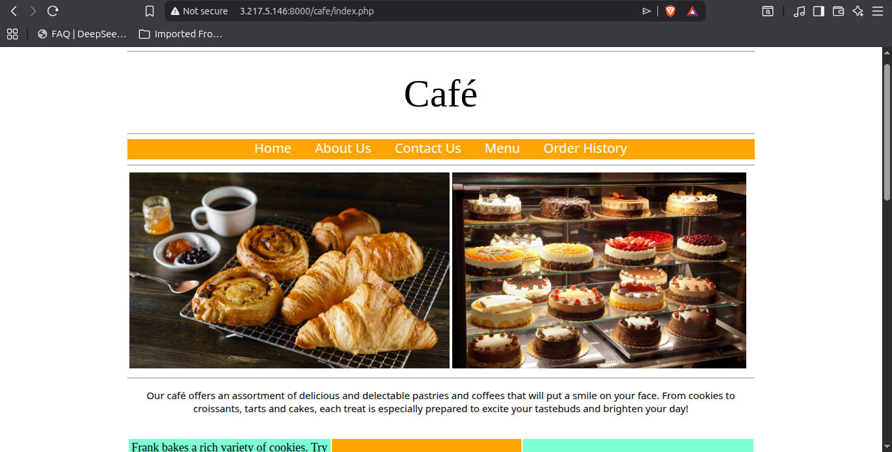

---

## Task 5: Testing the Web Application

### Order Placement Testing

1. Navigated to the Menu page
2. Submitted orders for multiple menu items
3. Verified orders appear in Order History

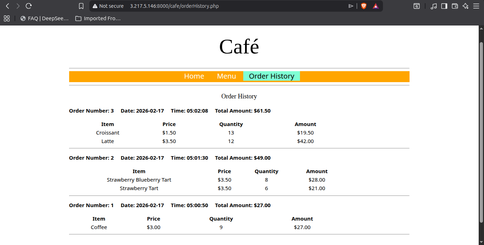

---

## Task 6: Creating an AMI and Launching Another EC2 Instance

### Preparing for AMI Creation

```bash
# Set static hostname
sudo hostname cafeserver

# Create SSH key pair
ssh-keygen -t rsa -f ~/.ssh/id_rsa
# (Pressed Enter for passphrase prompts)

# Make key available for SSH
cat ~/.ssh/id_rsa.pub >> ~/.ssh/authorized_keys
```

### Creating the AMI

1. Selected the Lab IDE instance in EC2 Console
2. Chose Actions > Images and templates > Create image
3. Named the image "CafeServer"
4. Created the image


### Copying AMI to Oregon Region

1. Navigated to AMIs in EC2 Console
2. Waited for image status to become "Available"
3. Selected the CafeServer AMI
4. Chose Actions > Copy AMI
5. Selected destination region: US West (Oregon) us-west-2
6. Initiated the copy


### Launching Production Instance in us-west-2

Configuration settings:
- **Name:** ProdCafeServer
- **Instance type:** t2.small
- **Key pair:** Proceed without key pair
- **VPC:** Lab VPC Region 2
- **Subnet:** Public Subnet
- **Security group:** cafeSG (ports 22 and 8000 open)
- **IAM instance profile:** CafeRole


### Configuring Secrets for Oregon Region

Edited the set-app-parameters.sh file:

```bash
# Line 15: Update region
region="us-west-2"

# Line 21: Update public DNS
publicDNS="<public-dns-of-ProdCafeServer-instance>"
```

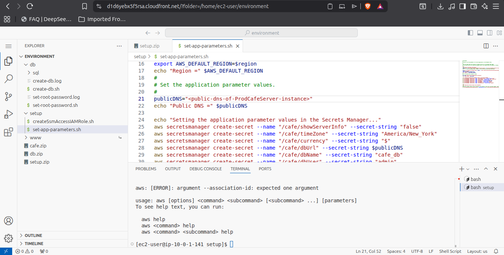
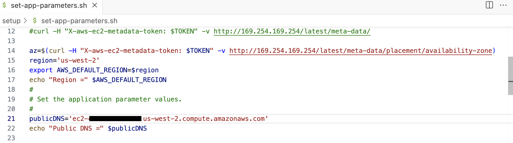

Ran the script:
```bash
cd ~/environment/setup/
./set-app-parameters.sh
```

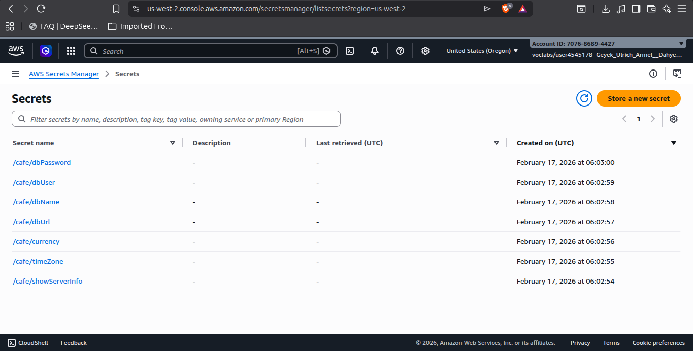

---

## Task 7: Verifying the New Cafe Instance

### Verification Steps

1. Confirmed ProdCafeServer instance is running in Oregon region
2. Copied the Public IPv4 address
3. Accessed http://<public-ip>:8000/ - test page loaded
4. Accessed http://<public-ip>:8000/cafe/ - full application loaded
5. Navigated to Menu page
6. Placed a test order successfully

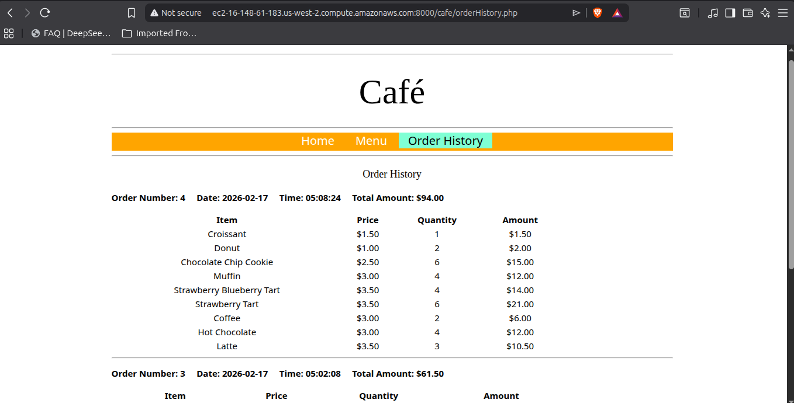
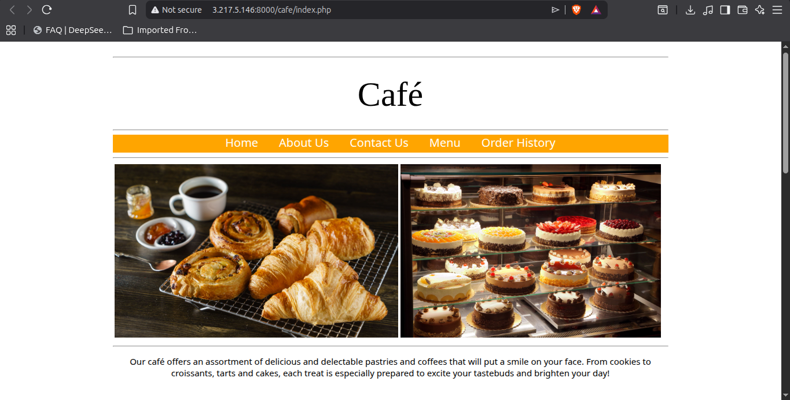
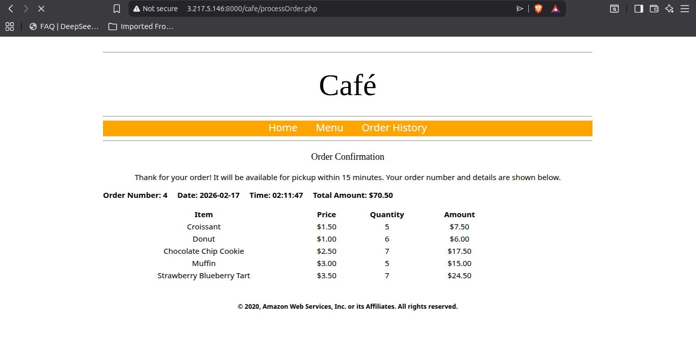

---

## Results Summary

### Development Environment (us-east-1)
- EC2 Instance: Lab IDE
- Purpose: Development and testing
- All application features functional

### Production Environment (us-west-2)
- EC2 Instance: ProdCafeServer
- Purpose: Production customer-facing site
- Independent Secrets Manager configuration
- Full order placement functionality working

### Key Achievements

1. Successfully configured LAMP stack on EC2
2. Integrated application with AWS Secrets Manager
3. Created and deployed AMI across regions
4. Implemented multi-region disaster recovery architecture
5. Verified end-to-end order placement workflow

---

## Skills Demonstrated

- EC2 instance configuration and management
- Apache web server setup and configuration
- MySQL/MariaDB database installation and administration
- PHP application deployment
- AWS Secrets Manager integration
- AMI creation and management
- Cross-region deployment strategies
- Security group and IAM role configuration
- Troubleshooting web application issues

---

## Conclusion

This lab provided hands-on experience with deploying a production-ready dynamic web application on AWS. The multi-region architecture ensures business continuity and provides a clear separation between development and production environments.

The cafe now has:
- A functional online ordering system
- A development environment for testing new features
- A production environment for customer access
- Disaster recovery capability through geographic redundancy

---

## References

- AWS Documentation: https://docs.aws.amazon.com/
- AWS Secrets Manager: https://aws.amazon.com/secrets-manager/
- Amazon EC2: https://aws.amazon.com/ec2/
- AWS Academy Learner Lab\
- ALX Africa

---

*Lab completed as part of AWS-ALx Cloud Computing Architecture course*
